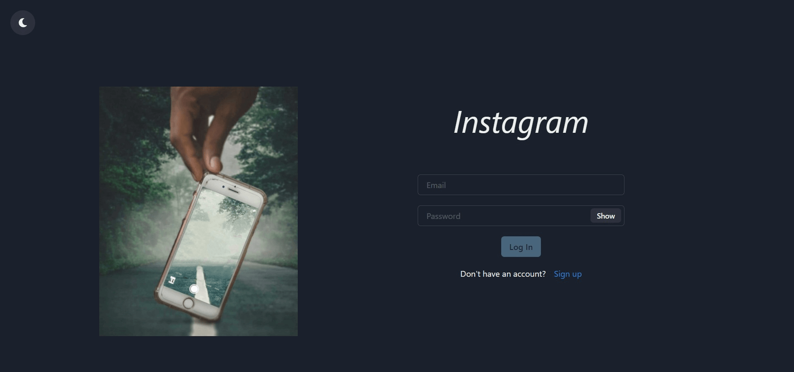

# instagram clone client


[](https://github.com/prettier/prettier)



.env

```
 REACT_APP_API_URL = REACT_APP_API_URL
```

## Getting started

```
https://github.com/scokljat/instagram-clone-client.git
```

To start the service run:

```
npm install
npm start
```

## License

[MIT](LICENSE)
